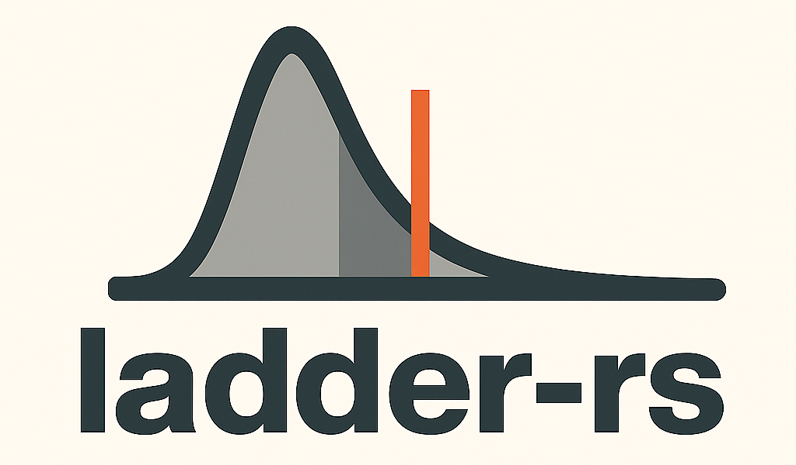

<div align="center">
  
</div>

# ladder-rs

A high-performance, extensible matchmaking library in Rust implementing modern rating algorithms for competitive games and tournaments.

## Features

- **Modular Architecture**: Trait-based design for easy extensibility and testing
- **Complete Rating Systems**:
  - **Elo**: Classic chess rating system with configurable K-factors
  - **Glicko & Glicko-2**: Modern rating systems with time-based rating periods and volatility
  - **TrueSkill**: Microsoft's Bayesian rating system with full match quality and rating updates
- **Type-Safe Implementation**: Mathematically sound with compile-time guarantees
- **Comprehensive Testing**: Unit tests, integration tests, and numerical robustness verification
- **Performance Optimized**: Benchmarks included for performance monitoring
- **Rich Examples**: Complete examples for each rating system

## Quick Start

Add ladder-rs to your `Cargo.toml`:

```toml
[dependencies]
ladder-rs = "0.1.0"
```

### Elo Rating System

```rust
use ladder_rs::{elo::{EloRating, EloTeamRating, EloSystem}, core::{GameOutcome, RatingSystem}};

fn main() -> ladder_rs::error::Result<()> {
    let system = EloSystem::new();
    let team1 = EloTeamRating::new(EloRating::new(1500.0));
    let team2 = EloTeamRating::new(EloRating::new(1500.0));

    let outcome = GameOutcome::win(0, 2); // team1 wins
    let updated = system.rate(&[team1, team2], &outcome)?;

    println!("New ratings: {:?}", updated);
    Ok(())
}
```

### TrueSkill Rating System

```rust
use ladder_rs::{
    trueskill::{TrueSkill, TrueSkillTeam},
    core::{RatingSystem, GameOutcome},
};

fn main() -> ladder_rs::error::Result<()> {
    let system = TrueSkill::new_simplified();
    
    // Create players with default ratings (μ=25, σ=25/3)
    let alice = system.create_rating();
    let bob = system.create_rating();
    
    let alice_team = TrueSkillTeam::from_player_ratings(vec![alice]);
    let bob_team = TrueSkillTeam::from_player_ratings(vec![bob]);
    
    // Alice wins
    let outcome = GameOutcome::win(0, 2);
    let updated = system.rate(&[alice_team, bob_team], &outcome)?;
    
    println!("Alice: μ={:.1}, σ={:.2}", 
             updated[0].player_ratings()[0].mean(),
             updated[0].player_ratings()[0].standard_deviation());
    Ok(())
}
```

## Algorithm Status

| Algorithm | Status | Features |
|-----------|--------|----------|
| **Elo** | ✅ Complete | Rating updates, configurable K-factors, team support |
| **Glicko** | ✅ Complete | Rating periods, volatility, time-based updates |
| **Glicko-2** | ✅ Complete | Enhanced volatility algorithm, rating periods |
| **TrueSkill** | ✅ Complete | Bayesian updates, match quality, team games, draws |

## Examples

Run the included examples to see each rating system in action:

```bash
# Basic examples for each system
cargo run --example elo_basic
cargo run --example glicko_basic
cargo run --example trueskill_basic

# Compare all rating systems
cargo run --example rating_comparison
```

## Testing

The library includes comprehensive test coverage:

```bash
# Run all tests
cargo test

# Run specific algorithm tests
cargo test elo
cargo test glicko
cargo test trueskill

# Run with coverage (requires coverage.sh script)
./coverage.sh
```

## Benchmarks

Performance benchmarks are available for all rating systems:

```bash
cargo bench
```

## Documentation

Generate and view the full API documentation:

```bash
cargo doc --open
```

## Contributing

1. Fork the repository
2. Create a feature branch
3. Add tests for new functionality
4. Ensure all tests pass: `cargo test`
5. Submit a pull request

## License

MIT - see LICENSE file for details.