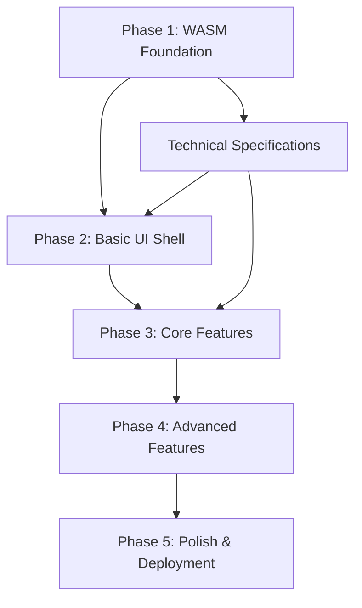

# WASM UI Implementation Documentation

This directory contains the hierarchical task breakdown for implementing the Rust WASM-backed UI interface for the ladder-rs library.

## Directory Structure

```
docs/wasm-ui/
├── README.md                           # This file
├── task-index.md                       # Complete task breakdown (111 subtasks)
├── dependencies-timeline.md            # Critical path and resource allocation
├── phase-01-wasm-foundation/          # 23 subtasks across 5 main tasks
├── phase-02-basic-ui-shell/           # 18 subtasks across 4 main tasks  
├── phase-03-core-features/            # 24 subtasks across 5 main tasks
├── phase-04-advanced-features/        # 26 subtasks across 6 main tasks
└── phase-05-polish-deployment/        # 20 subtasks across 5 main tasks
```

## How to Use This Documentation

Each phase directory contains:
- `README.md` - Phase overview and objectives
- `tasks/` - Individual task files with subtask breakdowns
- `deliverables/` - Expected outputs and acceptance criteria
- `dependencies/` - Task dependencies and prerequisites

## Task Status Tracking

Tasks are organized hierarchically with the following status indicators:
- 🔴 **Not Started** - Task has not been initiated
- 🟡 **In Progress** - Task is currently being worked on
- 🟢 **Completed** - Task has been finished and validated
- ⚪ **Blocked** - Task is waiting on dependencies

## Getting Started

1. Review the overall implementation plan in the root `wasm-ui-implementation-plan.md`
2. Start with Phase 1: WASM Foundation
3. Follow the task dependencies outlined in each phase
4. Update task status as work progresses

## Cross-Phase Dependencies

