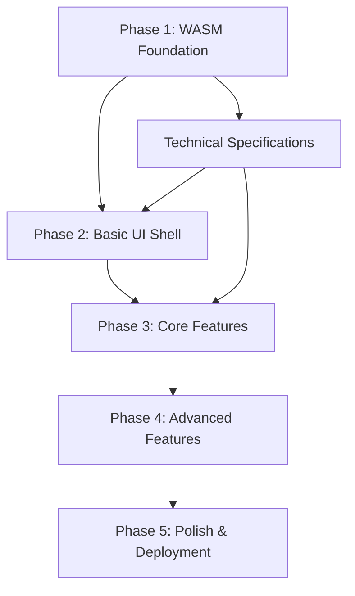

# WASM UI Implementation Documentation

This directory contains the hierarchical task breakdown for implementing the Rust WASM-backed UI interface for the ladder-rs library.

## Directory Structure

```
docs/wasm-ui/
├── README.md                           # This file
├── phase-01-wasm-foundation/          # Week 1-2: Core WASM setup
├── phase-02-basic-ui-shell/           # Week 3-4: UI framework foundation
├── phase-03-core-features/            # Week 5-8: Main functionality
├── phase-04-advanced-features/        # Week 9-12: Enhanced capabilities
├── phase-05-polish-deployment/        # Week 13-14: Production ready
├── technical-specifications/          # Architecture and design docs
├── testing-strategy/                  # Testing approaches and checklists
└── deployment-guides/                 # Build and deployment instructions
```

## How to Use This Documentation

Each phase directory contains:
- `README.md` - Phase overview and objectives
- `tasks/` - Individual task files with subtask breakdowns
- `deliverables/` - Expected outputs and acceptance criteria
- `dependencies/` - Task dependencies and prerequisites

## Task Status Tracking

Tasks are organized hierarchically with the following status indicators:
- 🔴 **Not Started** - Task has not been initiated
- 🟡 **In Progress** - Task is currently being worked on
- 🟢 **Completed** - Task has been finished and validated
- ⚪ **Blocked** - Task is waiting on dependencies

## Getting Started

1. Review the overall implementation plan in the root `wasm-ui-implementation-plan.md`
2. Start with Phase 1: WASM Foundation
3. Follow the task dependencies outlined in each phase
4. Update task status as work progresses

## Cross-Phase Dependencies

