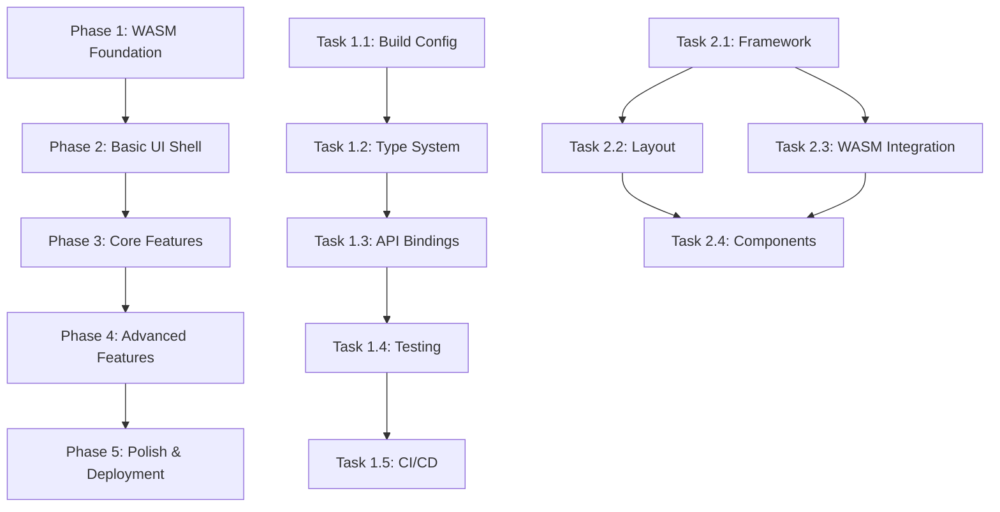

# WASM UI Dependencies & Timeline

## Critical Path Analysis

### Sequential Dependencies (Must Complete Before Next)



### Parallel Execution Opportunities

#### Phase 1 Parallelization
- Tasks 1.4 (Testing) and 1.5 (CI/CD) can run partially in parallel
- Type system work (1.2) can begin while build config (1.1) is finishing
- Different rating system implementations (1.3.2, 1.3.3, 1.3.4) can be done in parallel

#### Phase 2 Parallelization  
- Layout work (2.2) and WASM integration (2.3) can run in parallel after framework setup
- Component development (2.4) can begin as soon as basic integration is working

#### Phase 3+ Parallelization
- Most tasks within phases 3-5 can run in parallel as they're feature-independent
- UI and backend work can be parallelized with proper interface definitions

## Resource Allocation Timeline

### Week 1-2: Phase 1 - WASM Foundation
**Team:** 2 Rust/WASM developers

```
Week 1:
├── Developer A: Tasks 1.1, 1.2 (Build + Types)
└── Developer B: Research + Setup

Week 2:  
├── Developer A: Tasks 1.3.1, 1.3.2 (Unified API + Elo)
└── Developer B: Tasks 1.3.3, 1.3.4 (Glicko + TrueSkill)

Parallel: Task 1.4 (Testing), Task 1.5 (CI/CD)
```

### Week 3-4: Phase 2 - Basic UI Shell  
**Team:** 2 Frontend developers + 1 Designer

```
Week 3:
├── Frontend A: Task 2.1 (Framework Setup)
├── Frontend B: Task 2.2 (Layout Design)  
└── Designer: Component design system

Week 4:
├── Frontend A: Task 2.3 (WASM Integration)
├── Frontend B: Task 2.4 (Basic Components)
└── Designer: Mobile design optimization
```

### Week 5-8: Phase 3 - Core Features
**Team:** 2 Frontend developers + 1 Backend/WASM developer

```
Week 5-6: Foundation Features
├── Frontend A: Task 3.1 (Rating Visualization)
├── Frontend B: Task 3.2 (Match Processing)
└── Backend: Task 3.5 (Data Persistence)

Week 7-8: Advanced Features  
├── Frontend A: Task 3.3 (Leaderboards)
├── Frontend B: Task 3.4 (Parameter Config)
└── Backend: Performance optimization
```

### Week 9-12: Phase 4 - Advanced Features
**Team:** 2 Frontend developers + 1 Content creator

```
Week 9-10: Complex Features
├── Frontend A: Task 4.1 (Tournament System)
├── Frontend B: Task 4.2 (System Comparison)
└── Content: Task 4.3 (Educational Components)

Week 11-12: Tools & Polish
├── Frontend A: Task 4.4 (API Playground)  
├── Frontend B: Task 4.5 (Import/Export)
└── Content: Task 4.6 (Analytics) + Documentation
```

### Week 13-14: Phase 5 - Polish & Deployment
**Team:** Full team + DevOps engineer

```
Week 13: Polish & Testing
├── Frontend A: Task 5.1 (Responsive Design)
├── Frontend B: Task 5.2 (Performance)
├── Content: Task 5.3 (Documentation)
└── DevOps: Task 5.4 (Deployment Setup)

Week 14: Final QA & Launch
├── All: Task 5.5 (Testing & QA)
├── DevOps: Production deployment
└── Team: Launch preparation
```

## Risk Mitigation Strategies

### High-Risk Dependencies
1. **WASM Build Issues (Week 1)**
   - **Risk:** Build configuration problems delay entire project
   - **Mitigation:** Allocate extra senior developer time, have backup build strategies

2. **Framework Integration (Week 3-4)**
   - **Risk:** WASM-SvelteKit integration complexity
   - **Mitigation:** Create proof-of-concept early, have React fallback plan

3. **Performance Targets (Week 7-8)**
   - **Risk:** Bundle size or performance issues
   - **Mitigation:** Monitor metrics from day 1, plan optimization sprints

### Medium-Risk Dependencies
1. **Browser Compatibility (Week 2, 4, 6, 8, 10, 12, 14)**
   - **Mitigation:** Test on multiple browsers weekly
   
2. **Mobile Responsiveness (Week 4, 8, 13)**
   - **Mitigation:** Mobile-first design approach

3. **Educational Content Quality (Week 10-12)**
   - **Mitigation:** User feedback integration, iterative content development

## Milestone Checkpoints

### Week 2 Checkpoint: WASM Foundation Complete
**Success Criteria:**
- [ ] WASM package builds and loads in browser
- [ ] All three rating systems accessible via JavaScript
- [ ] Bundle size under 200KB
- [ ] Basic tests passing

**Go/No-Go Decision:** Proceed to UI development vs. address WASM issues

### Week 4 Checkpoint: UI Foundation Complete  
**Success Criteria:**
- [ ] SvelteKit app loads and displays correctly
- [ ] WASM integration working
- [ ] Basic player/match management functional
- [ ] Mobile responsive layout complete

**Go/No-Go Decision:** Proceed to feature development vs. UI architecture changes

### Week 8 Checkpoint: Core Features Complete
**Success Criteria:**
- [ ] Rating visualizations working
- [ ] Match processing and history functional  
- [ ] Leaderboards updating correctly
- [ ] Parameter configuration working
- [ ] Performance targets met

**Go/No-Go Decision:** Proceed to advanced features vs. core feature polish

### Week 12 Checkpoint: Advanced Features Complete
**Success Criteria:**
- [ ] Tournament system functional
- [ ] Rating comparison tools working
- [ ] Educational content complete
- [ ] API playground operational
- [ ] Import/export working

**Go/No-Go Decision:** Proceed to final polish vs. feature scope reduction

### Week 14 Checkpoint: Production Ready
**Success Criteria:**
- [ ] All features tested and working
- [ ] Performance optimized
- [ ] Documentation complete
- [ ] Deployment successful
- [ ] Monitoring in place

## Buffer Time Allocation

**Built-in Buffers:**
- 10% buffer time in each phase for unexpected issues
- 1 week buffer between major milestones for integration testing
- Reduced scope options identified for each phase

**Scope Reduction Options by Phase:**
- **Phase 4:** Remove tournament system or educational content
- **Phase 3:** Simplify visualizations or remove advanced analytics  
- **Phase 2:** Reduce mobile optimization or component variety
- **Phase 1:** Reduce to single rating system initially

## Success Metrics by Phase

### Phase 1 Success Metrics
- Bundle size: < 200KB
- Load time: < 500ms
- Test coverage: 100% for WASM bindings
- Build time: < 30 seconds

### Phase 2 Success Metrics  
- Lighthouse performance: > 80
- Mobile responsiveness: All screen sizes
- TypeScript errors: 0
- WASM integration: Error-free loading

### Phase 3 Success Metrics
- Chart rendering: < 100ms for 1000 data points
- Real-time updates: < 50ms latency
- Data persistence: Reliable local storage
- Match processing: < 10ms per match

### Phase 4 Success Metrics
- Tournament generation: < 1s for 64 players
- Educational content: User feedback > 4/5
- API playground: Functional code execution
- Import/export: Support 3+ file formats

### Phase 5 Success Metrics
- Overall Lighthouse score: > 90
- Cross-browser compatibility: 95%+ browsers
- Documentation completeness: 100% API coverage
- Production uptime: 99.9%